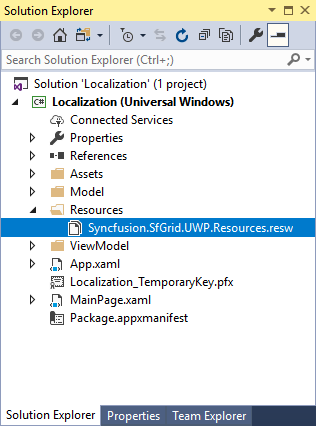
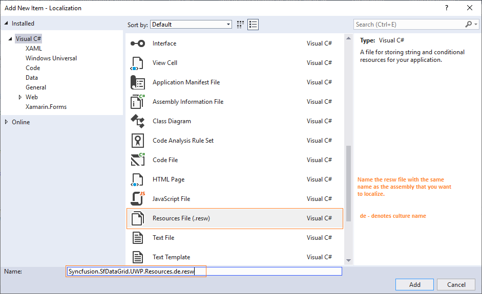
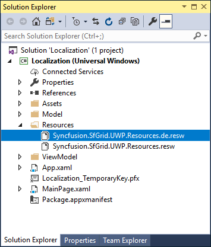
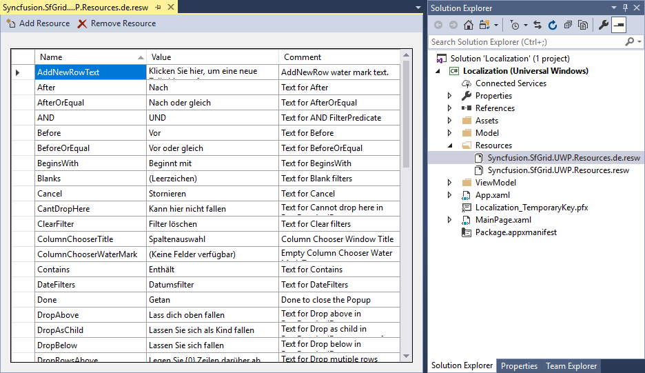

# How to Apply Localization for UWP DataGrid?

This repository contains sample which shows localization of Syncfusion [UWP DataGrid](https://www.syncfusion.com/uwp-ui-controls/datagrid) (SfDataGrid).

[Localization](https://help.syncfusion.com/uwp/localization) is the process of translating the application resources into different language for the specific cultures. You can localize the `DataGrid` by adding resource file for each language.

### Changing application culture

When you are changing the application culture, then you can localize the application based on application culture by creating .resw file.

#### C#

``` csharp
public sealed partial class MainPage
{
    public MainPage()
    {
        CultureInfo.CurrentUICulture = new CultureInfo("de");
        this.InitializeComponent();
    }
}
```

#### VB

``` vb
Public NotInheritable Partial Class MainPage
	Public Sub New()
		CultureInfo.CurrentUICulture = New CultureInfo("de")
		Me.InitializeComponent()
	End Sub
End Class
```

### Creating .resw files

You can create .resw files for any language by following steps,

1. Right click your project and add new folder named `Resources`.

2. Add [default resource files](https://github.com/syncfusion/uwp-controls-localization-resource-files) of libraries you are using into `Resources` folder.



3. Now, right click `Resources` folder and select Add and then `New Item`. In `Add New Item wizard`, select the `Resources` File option and name the file name as `Syncfusion.SfGrid.UWP.Resources.<culture name>.resw`. For example, you have to give name as `Syncfusion.SfDataGrid.UWP.Resources.de.resw` for `German` culture. In the same way, add new resource files for other libraries used in your application.



4. Now, select Add and add resource file for `German` culture in `Resources` folder.



5. Now, you can copy the key names and from default `resource` files and assign value based on the culture, the resource file targets.

